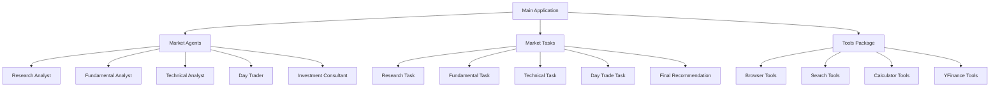

# 🚀 CrewAI Stock Analysis - Sistema Avançado de Análise de Ações

<div align="center">


**Sistema profissional de análise de ações com IA avançada, MCP e múltiplas fontes de dados**

[Características](#-características) •
[Instalação](#-instalação) •
[Configuração](#-configuração) •
[Uso](#-uso) •
[Docker](#-docker) •
[APIs](#-apis-e-integrações)

</div>

---

## 📋 Índice

- [Visão Geral](#-visão-geral)
- [Características](#-características)
- [Arquitetura](#-arquitetura)
- [Agentes Especializados](#-agentes-especializados)
- [Instalação](#-instalação)
- [Configuração](#-configuração)
- [APIs e Integrações](#-apis-e-integrações)
- [Uso](#-uso)
- [Docker](#-docker)
- [Exemplos](#-exemplos)
- [Contribuição](#-contribuição)
- [Licença](#-licença)

---

## 🎯 Visão Geral

O **CrewAI Stock Analysis** é um sistema avançado de análise de ações que utiliza múltiplos agentes de IA especializados para fornecer análises abrangentes e recomendações de investimento de alta qualidade. Cada agente possui expertise específica e trabalha em conjunto para criar relatórios profissionais.

### 🎪 O que torna este sistema único?

- **🤖 5 Agentes Especializados**: Cada um com expertise específica
- **🔄 Análise Colaborativa**: Agentes trabalham em sequência e compartilham insights
- **📊 Multi-Timeframe**: Análises de curto, médio e longo prazo
- **🇧🇷 Foco no Mercado Brasileiro**: Otimizado para B3 e economia brasileira
- **🐳 Docker Multi-Arquitetura**: Suporte para AMD64 e ARM64
- **📱 Interface Flexível**: CLI, batch processing e modo interativo
- **🤖 MCP Integration**: Model Context Protocol para Alpha Vantage
- **🔍 Multi-Search**: SearXNG, Tavily, Google API, SerpAPI

---

## ✨ Características

### 🎯 Tipos de Análise

| Tipo | Descrição | Agentes Envolvidos | Tempo Estimado |
|------|-----------|-------------------|----------------|
| **Quick** | Análise rápida essencial | Research + Fundamental + Technical + Consultant | 5-10 min |
| **Complete** | Análise completa com day trade | Todos os 5 agentes | 15-25 min |
| **Technical** | Foco em análise técnica | Research + Technical | 3-7 min |
| **Fundamental** | Foco em fundamentos | Research + Fundamental | 5-12 min |

### 📊 Relatórios Gerados

- **📈 Análise de Pesquisa**: Contexto geral e notícias
- **💰 Análise Fundamentalista**: Indicadores financeiros e valuation
- **📉 Análise Técnica**: Níveis, indicadores e setups
- **⚡ Estratégias Day Trade**: Setups específicos e timing
- **🎯 Recomendação Final**: Síntese e estratégia de investimento

### 🛠 Ferramentas Integradas

- **Yahoo Finance**: Dados financeiros em tempo real
- **Web Scraping**: Coleta de notícias e informações
- **Calculadora Financeira**: Métricas e indicadores
- **APIs de Notícias**: Informações atualizadas do mercado

---

## 🏗 Arquitetura



---

## 🤖 Agentes Especializados

### 1. 🔍 **Analista de Pesquisa**
- **Expertise**: Coleta e interpretação de dados de mercado
- **Responsabilidades**:
  - Análise de notícias e sentimento de mercado
  - Contexto macroeconômico brasileiro e global
  - Identificação de catalisadores e riscos
  - Análise setorial e competitiva

### 2. 💼 **Analista Fundamentalista**
- **Expertise**: Análise financeira e valuation
- **Responsabilidades**:
  - Demonstrações financeiras (DRE, Balanço, DFC)
  - Indicadores fundamentalistas (P/L, ROE, ROIC)
  - Modelos de valuation e preço justo
  - Análise de dividendos e sustentabilidade

### 3. 📈 **Analista Técnico**
- **Expertise**: Análise técnica e timing de mercado
- **Responsabilidades**:
  - Identificação de tendências e padrões
  - Suporte, resistência e pontos de entrada
  - Indicadores técnicos (RSI, MACD, Médias)
  - Análise de volume e momentum

### 4. ⚡ **Consultor Day Trade**
- **Expertise**: Estratégias de curtíssimo prazo
- **Responsabilidades**:
  - Setups de day trade específicos
  - Gerenciamento de risco intraday
  - Timing preciso de entrada e saída
  - Análise de múltiplos timeframes

### 5. 🎯 **Consultor de Investimentos**
- **Expertise**: Síntese e estratégia global
- **Responsabilidades**:
  - Integração de todas as análises
  - Recomendação final ponderada
  - Estratégias por perfil de investidor
  - Gestão de portfólio e risco

---

## 📦 Instalação

### Pré-requisitos

- **Python 3.11+**
- **Docker** (opcional, mas recomendado)
- **Chave API Anthropic** (obrigatória)
- **APIs Google/News** (opcionais)

### 🐍 Instalação Local

```bash
# Clone o repositório
git clone https://github.com/rlquilez/crewai-acoes.git
cd crewai-acoes

# Crie ambiente virtual
python -m venv venv
source venv/bin/activate  # Linux/Mac
# ou
venv\Scripts\activate     # Windows

# Instale dependências
pip install -r requirements.txt

# ⚠️ PROBLEMA CONHECIDO: Se o comando acima falhar com erro sobre 'mcp':
# Use o arquivo alternativo sem MCP:
pip install -r requirements-no-mcp.txt
# Depois instale o MCP manualmente (opcional):
pip install mcp

# Configure ambiente
cp .env.example .env
# Edite .env com suas chaves de API
```

### 🐳 Instalação com Docker

```bash
# Clone o repositório
git clone https://github.com/rlquilez/crewai-acoes.git
cd crewai-acoes

# Inicialização rápida
./docker/quickstart.sh

# Ou manual
cp .env.example .env
# Configure suas APIs no .env
docker-compose build
```

---

## ⚙️ Configuração

### 🔑 Configuração do Ambiente

Copie o arquivo `.env.example` para `.env` e configure suas credenciais:

```bash
cp .env.example .env
```

Edite o arquivo `.env` com suas configurações:

```bash
# =============================================================================
# CONFIGURAÇÕES DE LLM (Language Model Providers)
# =============================================================================

# Provedor padrão de LLM (openai, anthropic, deepseek, grok, ollama)
DEFAULT_LLM=openai

# OpenAI Configuration (GPT-4) - Padrão
OPENAI_API_KEY=sk-proj-XXXXXXXX
OPENAI_MODEL=gpt-4o

# Anthropic Configuration (Claude)
ANTHROPIC_API_KEY=sk-ant-api03-XXXXXXXX
ANTHROPIC_MODEL=claude-3-5-sonnet-20241022

# Deepseek Configuration (Reasoner)
DEEPSEEK_API_KEY=sk-XXXXXXXX
DEEPSEEK_MODEL=deepseek-reasoner

# Grok Configuration (X.AI)
GROK_API_KEY=xai-XXXXXXXX
GROK_MODEL=grok-2-1212

# Ollama Configuration (Local)
OLLAMA_MODEL=llama3.2:latest
OLLAMA_BASE_URL=http://localhost:11434

# =============================================================================
# CONFIGURAÇÕES DE BUSCA (Search Providers)
# =============================================================================

# Provedor padrão de busca (searxng, tavily, google, serpapi)
DEFAULT_SEARCH_PROVIDER=tavily

# SearXNG Configuration (Privacy-focused)
SEARXNG_URL=http://searxng:8080

# Tavily AI Search (Recomendado para IA)
TAVILY_API_KEY=XXXXXXXX

# Google Custom Search API (Fallback)
GOOGLE_API_KEY=XXXXXXXX
GOOGLE_CSE_ID=XXXXXXXX

# SerpAPI Configuration (Alternative)
SERPAPI_KEY=XXXXXXXX

# =============================================================================
# CONFIGURAÇÕES DE DADOS FINANCEIROS
# =============================================================================

# Yahoo Finance (Sempre ativo - Gratuito)
YAHOO_FINANCE_ENABLED=true

# Alpha Vantage + MCP (Recomendado)
ALPHA_VANTAGE_API_KEY=XXXXXXXX
ALPHA_VANTAGE_ENABLED=true

# MCP (Model Context Protocol) Configuration
MCP_ENABLED=true
MCP_ALPHA_VANTAGE_ENDPOINT=https://mcp.alphavantage.co

# Browserless Configuration
BROWSERLESS_URL=http://browserless:3000
```

### 📝 Como Obter as APIs

#### 1. 🤖 **Provedores de LLM**

**OpenAI (Recomendado)**
1. Acesse [platform.openai.com](https://platform.openai.com)
2. Crie uma conta e adicione créditos
3. Gere uma API key na seção "API Keys"

**Anthropic Claude**
1. Acesse [console.anthropic.com](https://console.anthropic.com)
2. Crie uma conta e adicione créditos
3. Gere uma API key na seção "API Keys"

**Deepseek**
1. Acesse [platform.deepseek.com](https://platform.deepseek.com)
2. Registre-se e obtenha API key
3. Modelo Reasoner para análises complexas

**Grok (X.AI)**
1. Acesse [x.ai](https://x.ai)
2. Registre-se na plataforma
3. Obtenha API key para Grok-2

**Ollama (Local)**
1. Instale [Ollama](https://ollama.ai)
2. Execute: `ollama pull llama3.2`
3. Configure URL local (padrão: localhost:11434)

#### 2. 🔍 **Provedores de Busca**

**SearXNG (Incluído - Padrão)**
- Motor de busca privado incluído no Docker Compose
- Configuração automática quando usar Docker
- Mais privacidade e sem limites de API

**Tavily AI Search (Recomendado para IA)**
1. Registre-se em [tavily.com](https://tavily.com)
2. Obtenha API key na dashboard
3. Configure `TAVILY_API_KEY=sua_key_aqui`
4. **Vantagens**: 
   - Busca otimizada para IA e LLMs
   - Respostas estruturadas e contextualizadas
   - Filtros avançados por profundidade
   - Ideal para análise de mercado em tempo real

**Google Custom Search (Fallback)**
1. Acesse [Google Cloud Console](https://console.cloud.google.com)
2. Ative a "Custom Search JSON API"
3. Crie um Custom Search Engine em [cse.google.com](https://cse.google.com)

**SerpAPI (Alternativa Premium)**
1. Registre-se em [serpapi.com](https://serpapi.com)
2. Obtenha API key com créditos

#### 3. 📊 **Dados Financeiros**

**Yahoo Finance (Sempre Ativo)**
- Gratuito e sem necessidade de configuração
- Dados básicos de ações, índices e fundos

**Alpha Vantage + MCP (Recomendado)**
1. Registre-se em [alphavantage.co](https://www.alphavantage.co)
2. Obtenha API key gratuita ou premium
3. **🤖 MCP Integration**: [mcp.alphavantage.co](https://mcp.alphavantage.co)
4. Configure as variáveis:
   ```bash
   ALPHA_VANTAGE_API_KEY=sua_key_aqui
   MCP_ENABLED=true
   MCP_ALPHA_VANTAGE_ENDPOINT=https://mcp.alphavantage.co
   ```
5. **Vantagens do MCP**:
   - Protocolo Model Context Protocol
   - Dados estruturados em tempo real
   - Melhor compatibilidade com LLMs
   - Formato otimizado para análise de IA
   - Acesso direto a demonstrações financeiras
   - Dados fundamentalistas completos

### 🔧 Hierarquia de Fontes de Dados

O sistema utiliza uma abordagem em camadas para máxima confiabilidade:

```
1. 🤖 MCP Alpha Vantage (Prioridade)
   ↓ (fallback se indisponível)
2. 📊 Alpha Vantage Traditional API
   ↓ (fallback se indisponível)  
3. 📈 Yahoo Finance (Base sempre ativa)
```

**Para Busca:**
```
1. 🧠 Tavily AI Search (Otimizado para IA)
   ↓ (fallback baseado em configuração)
2. 🔍 SearXNG (Privacidade)
   ↓ (fallback)
3. 🌐 Google Custom Search
   ↓ (fallback)
4. 🐍 SerpAPI (Premium)
```

### 📝 Como Obter as APIs

#### 1. 🤖 **Provedores de LLM** (Obrigatório - escolha um)

**OpenAI (Recomendado)**
1. Acesse [platform.openai.com](https://platform.openai.com)
2. Crie uma conta e adicione créditos
3. Gere uma API key na seção "API Keys"
4. Configure: `DEFAULT_LLM=openai` e `OPENAI_API_KEY=sua_key`

**Anthropic Claude**
1. Acesse [console.anthropic.com](https://console.anthropic.com)
2. Crie uma conta e adicione créditos
3. Gere uma API key na seção "API Keys"
4. Configure: `DEFAULT_LLM=anthropic` e `ANTHROPIC_API_KEY=sua_key`

**Deepseek**
1. Acesse [platform.deepseek.com](https://platform.deepseek.com)
2. Registre-se e obtenha API key
3. Configure: `DEFAULT_LLM=deepseek` e `DEEPSEEK_API_KEY=sua_key`

**Grok (X.AI)**
1. Acesse [x.ai](https://x.ai)
2. Registre-se na plataforma
3. Configure: `DEFAULT_LLM=grok` e `GROK_API_KEY=sua_key`

**Ollama (Local)**
1. Instale [Ollama](https://ollama.ai)
2. Execute: `ollama pull llama3.2`
3. Configure: `DEFAULT_LLM=ollama`

#### 2. SearXNG e Browserless (Incluídos)
- **SearXNG**: Motor de busca privado incluído no Docker Compose
- **Browserless**: Serviço de navegação headless incluído no Docker Compose
- Ambos são configurados automaticamente quando você usar Docker

#### 3. Google Custom Search (Fallback Opcional)
1. Acesse [Google Cloud Console](https://console.cloud.google.com)
2. Ative a "Custom Search JSON API"
3. Crie um Custom Search Engine em [cse.google.com](https://cse.google.com)

#### 4. News API (Opcional)
1. Registre-se em [newsapi.org](https://newsapi.org)
2. Obtenha sua API key gratuita

---

## 🚀 Uso

### 📱 Linha de Comando

```bash
# Análise individual (modo rápido)
python main.py PETR4.SA

# Análise completa
python main.py PETR4.SA --type complete

# Análise técnica apenas
python main.py PETR4.SA --type technical

# Análise fundamentalista apenas
python main.py PETR4.SA --type fundamental

# Análise em lote
python main.py --batch PETR4.SA VALE3.SA ITUB4.SA

# Modo interativo
python main.py

# Listar símbolos populares
python main.py --list-symbols
```

### 🐳 Com Docker

```bash
# Análise individual
docker-compose run --rm crewai-stock-analysis python main.py PETR4.SA

# Análise em lote
docker-compose run --rm crewai-stock-analysis python main.py --batch PETR4.SA VALE3.SA

# Modo interativo
docker-compose run --rm crewai-stock-analysis python main.py

# Com Jupyter Lab
docker-compose --profile jupyter up -d
# Acesse: http://localhost:8888 (token: crewai2024)
```

### 📊 Exemplo de Saída

```
🚀 Sistema de Análise de ações CrewAI inicializado!
📅 Data: 18/09/2025 14:30
🤖 Modelo LLM: Configurado automaticamente (OpenAI/Anthropic/Deepseek/Grok/Ollama)
🔍 Search Provider: Tavily AI Search (AI-optimized)
📊 Data Sources: MCP Alpha Vantage → Alpha Vantage → Yahoo Finance
------------------------------------------------------------

📊 Iniciando análise de PETR4.SA
🔍 Tipo de análise: quick
============================================================

🎬 Executando análise com 5 agentes...

[Research Analyst] 🧠 Tavily AI Search: Coletando notícias...
[Research Analyst] 🤖 MCP Alpha Vantage: Dados em tempo real...
[Fundamental Analyst] 📊 MCP: Demonstrações financeiras estruturadas...
[Technical Analyst] 📈 Identificando níveis técnicos...
[Day Trade Consultant] ⚡ Setups intraday disponíveis...
[Investment Consultant] 🎯 Consolidando recomendação final...

✅ Análise de PETR4.SA concluída com sucesso!
📁 Relatórios salvos na pasta 'reports/'

📋 STATUS DAS FONTES:
• Yahoo Finance: ✅ Ativo (base sempre disponível)
• MCP Alpha Vantage: ✅ Ativo (prioritário)
• Alpha Vantage Traditional: ✅ Ativo (fallback)
• Tavily AI Search: ✅ Ativo (otimizado para IA)
• SearXNG: ✅ Disponível (privacidade)
• Google/SerpAPI: ✅ Disponível (fallback)
```

### 🧪 Testando as Novas Funcionalidades

**Teste MCP Integration:**
```bash
# Verificar se MCP está funcionando
python -c "
from src.config.mcp_client import AlphaVantageMCPClient
import asyncio

async def test_mcp():
    client = AlphaVantageMCPClient()
    data = await client.get_comprehensive_data_mcp('AAPL')
    print('MCP Status:', 'OK' if data else 'Failed')

asyncio.run(test_mcp())
"
```

**Teste Tavily Search:**
```bash
# Verificar se Tavily está funcionando
python -c "
from src.config.search_config import SearchConfig

config = SearchConfig()
results = config.search('Petrobras quarterly results 2024', provider='tavily')
print('Tavily Status:', 'OK' if results else 'Failed')
"
```

---

## 🐳 Docker

### 🏗 Build Multi-Arquitetura

```bash
# Build para AMD64 e ARM64
./docker/build-multiarch.sh

# Build local apenas
docker build -f docker/Dockerfile -t crewai-stock-analysis .
```

### 📋 Serviços Disponíveis

```bash
# Todos os serviços (recomendado)
docker-compose up -d

# Aplicação principal apenas
docker-compose up crewai-stock-analysis

# Com cache Redis
docker-compose --profile cache up -d

# Com Jupyter Lab para análise interativa
docker-compose --profile jupyter up -d

# Todos os serviços incluindo cache e Jupyter
docker-compose --profile cache --profile jupyter up -d
```

### 🔧 Configurações Docker

| Serviço | Porta | Descrição | Perfil |
|---------|-------|-----------|--------|
| CrewAI App | - | Aplicação principal | default |
| SearXNG | 8080 | Motor de busca privado | default |
| Browserless | 3000 | Navegação headless | default |
| Redis | 6379 | Cache (opcional) | cache |
| Jupyter | 8888 | Análise interativa | jupyter |

### 🌐 URLs dos Serviços

Após iniciar com Docker Compose:

- **SearXNG**: http://localhost:8080 - Interface de busca
- **Browserless**: http://localhost:3000 - API de navegação
- **Jupyter Lab**: http://localhost:8888 - Análise interativa (se habilitado)

### 🔒 Benefícios da Arquitetura com SearXNG e Browserless

- **Privacidade**: Suas buscas não passam pelo Google diretamente
- **Self-hosted**: Controle total sobre os dados e configurações
- **Performance**: Cache local e otimizações específicas
- **Confiabilidade**: Fallback para Google Search quando necessário
- **Escalabilidade**: Facilmente escalável para múltiplos usuários

---

## 📚 Exemplos

### 🎯 Análise Completa - PETR4.SA

```python
from main import StockAnalysisApp

# Inicializar aplicação
app = StockAnalysisApp()

# Análise completa
result = app.analyze_stock("PETR4.SA", "complete")

# Resultado inclui:
# - Relatório de pesquisa
# - Análise fundamentalista
# - Análise técnica  
# - Estratégias day trade
# - Recomendação final
```

### 📊 Análise em Lote

```python
# Múltiplas ações
symbols = ["PETR4.SA", "VALE3.SA", "ITUB4.SA"]
results = app.batch_analyze(symbols, "quick")

# Processa todas as ações
# Salva relatórios individuais
# Retorna sumário consolidado
```

### 📈 Estrutura dos Relatórios

```
reports/
├── research_PETR4.SA_20250918_1430.md
├── fundamental_PETR4.SA_20250918_1430.md
├── technical_PETR4.SA_20250918_1430.md
├── daytrader_PETR4.SA_20250918_1430.md
├── final_recommendation_PETR4.SA_20250918_1430.md
└── execution_log_PETR4.SA_20250918_1430.log
```

---

## 🔌 API e Integrações

### 📊 Dados Utilizados

#### 🏗️ Fontes de Dados Financeiros

| Fonte | Tipo de Dados | Frequência | Prioridade |
|-------|---------------|------------|------------|
| **🤖 MCP Alpha Vantage** | Dados estruturados para IA, demonstrações financeiras completas | Tempo real | 1ª (Prioritário) |
| **📊 Alpha Vantage Traditional** | Fundamentalistas, earnings, balanço, DRE, fluxo de caixa | Tempo real | 2ª (Fallback) |
| **📈 Yahoo Finance** | Preços, volumes, indicadores básicos, histórico | Tempo real | 3ª (Base sempre ativa) |

#### 🔍 Provedores de Busca

| Provedor | Tipo de Busca | Características | Prioridade |
|----------|---------------|-----------------|------------|
| **🧠 Tavily AI Search** | Busca otimizada para IA | Respostas estruturadas, contexto para LLMs | 1ª (Recomendado) |
| **🔍 SearXNG** | Motor de busca privado | Self-hosted, privacidade, sem limites | 2ª (Incluído no Docker) |
| **🌐 Google Custom Search** | Busca tradicional | API oficial Google, ampla cobertura | 3ª (Fallback) |
| **🐍 SerpAPI** | Busca premium | Dados estruturados, múltiplos engines | 4ª (Premium) |

#### 🛠️ Ferramentas Auxiliares

| Ferramenta | Função | Integração |
|------------|---------|------------|
| **Browserless** | Navegação headless para scraping | Docker incluído |
| **Redis Cache** | Cache de dados e sessões | Opcional (Docker profile) |
| **Jupyter Lab** | Análise interativa | Opcional (Docker profile) |

### 🛠 Ferramentas Técnicas

- **RSI**: Relative Strength Index
- **MACD**: Moving Average Convergence Divergence  
- **Bollinger Bands**: Bandas de volatilidade
- **Fibonacci**: Retrações e projeções
- **Volume Profile**: Análise de volume por preço

### 💰 Indicadores Fundamentalistas

- **Valuation**: P/L, P/VPA, EV/EBITDA
- **Rentabilidade**: ROE, ROA, ROIC
- **Endividamento**: D/E, Liquidez
- **Crescimento**: CAGR, Margem, Eficiência

---

## 🤝 Contribuição

### 🔧 Desenvolvimento

```bash
# Fork e clone
git clone https://github.com/SEU_USUARIO/crewai-acoes.git
cd crewai-acoes

# Crie branch para feature
git checkout -b feature/nova-funcionalidade

# Desenvolva e teste
python -m pytest tests/

# Commit e push
git commit -m "feat: adiciona nova funcionalidade"
git push origin feature/nova-funcionalidade
```

### 📝 Issues e Sugestões

- 🐛 **Bugs**: Use o template de bug report
- ✨ **Features**: Descreva a funcionalidade desejada
- 📚 **Documentação**: Melhorias na documentação
- 🔧 **Performance**: Otimizações e melhorias

### 🧪 Testes

```bash
# Executar testes
python -m pytest

# Com coverage
python -m pytest --cov=src

# Testes específicos
python -m pytest tests/test_agents.py
```

---

## 📄 Licença

Este projeto está licenciado sob a **MIT License** - veja o arquivo [LICENSE](LICENSE) para detalhes.

---

### 🙏 Agradecimentos

- **CrewAI Team**: Framework excepcional para agentes colaborativos
- **Anthropic**: Claude 3 Sonnet para análises de alta qualidade
- **Yahoo Finance**: Dados financeiros confiáveis e gratuitos
- **SearXNG**: Motor de busca privado e open-source
- **Browserless**: Solução de navegação headless para scraping
- **Comunidade Python**: Bibliotecas e ferramentas incríveis

---


## 📞 Suporte

- **📧 Email**: [suporte@quilez.cloud](mailto:suporte@quilez.cloud)
- **💬 Discord**: [CrewAI Brasil](https://discord.gg/crewai-brasil)
- **📖 Documentação**: [docs.quilez.cloud](https://docs.quilez.cloud)
- **🐛 Issues**: [GitHub Issues](https://github.com/rlquilez/crewai-acoes/issues)

---

<div align="center">

**🚀 Feito com ❤️ por desenvolvedores brasileiros**

⭐ **Se este projeto foi útil, deixe uma estrela!** ⭐

</div>